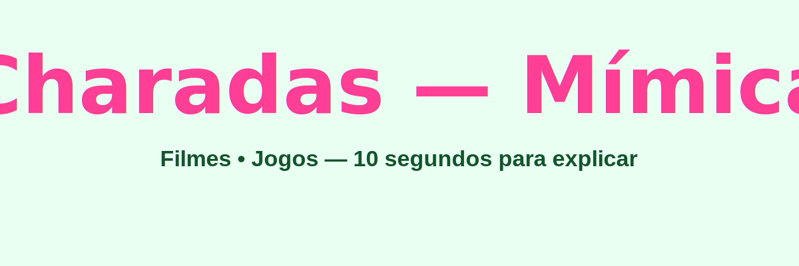

# Charadas — Projeto 001 (mimica)

Pequeno jogo de charadas (mímica) para ser executado no terminal. O jogador escolhe um tema (Filmes ou Jogos) e o programa sorteia um item; o jogador tem 10 segundos para explicar o item a um amigo.

## Arquivos
- `app.py`: implementação principal do jogo.

## Como funciona
- O programa começa com duas listas predefinidas de itens: filmes e jogos.
- O usuário pode ver as listas, adicionar ou remover itens antes de começar.
- Ao escolher um tema, o programa sorteia um item aleatório e inicia um contador de 10 segundos.
- Ao final do tempo, o jogador pode optar por continuar ou encerrar o jogo.



## Requisitos
- Python 3.10+ (funciona em 3.8+, mas recomenda-se 3.10+)
- Não há dependências externas.

## Como executar (Windows - PowerShell)
1. Criar e ativar um ambiente virtual (opcional):

```powershell
python -m venv .venv
.\.venv\Scripts\Activate.ps1
```

2. Executar o jogo:

```powershell
python 001_mimica\app.py
```

## Uso rápido
- Responda `Sim` quando perguntado se quer ver os temas e palavras.
- Para adicionar um item: responda o grupo (`Filmes` ou `Jogos`) e digite o item.
- Para remover um item: responda o grupo e digite o item (use exatamente o mesmo texto).
- Para jogar: digite `Filmes` ou `Jogos` quando perguntado por qual tema gostaria de jogar.
